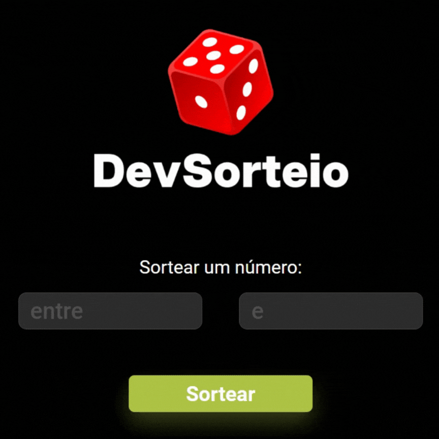
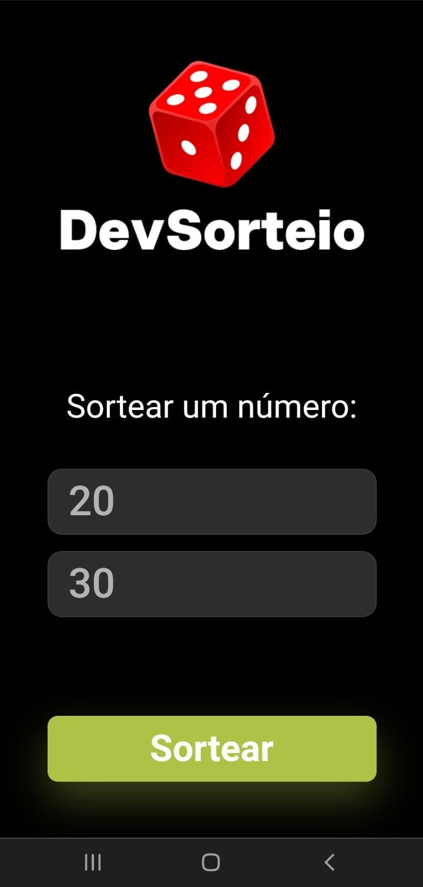

# Dev Sorteio

Este repositório contém o projeto Dev Sorteio que é um site para fazer sorteios. O objetivo do projeto foi criar uma aplicação simples para converter valores entre as principais cotas e criptomoedas, com a linguagem JavaScript, HTML e CSS.

🔗 [Click here to access](https://n4ju15.github.io/dev_sorteador/)

## Para Desktop

## Para Mobile

## Tecnologias

- HTML
- CSS
- JavaScript
- Git and Github

